# Introduction to Bootstrap 3

Author: [Sofoklis Stouraitis](mailto:sofos@aueb.gr)


## Front-End Web UI Frameworks

* **What is a front-end UI framework?**
  * A collection of ready-to-use HTML, CSS and JavaScript templates for UI components (Typography, Forms, Buttons, Tables, Navigations, Dropdowns, Alerts, Modals, Tabs, Accordion,Carousel etc)

* **Why front-end UI framework?**
  1. Responsive web design
     * Mobile first
  2. Cross-browser compatibility
     * Dealing with quirks of browsers
  3. Increased productivity
     * Easy to get started
  4. Community support
     * Resources and web page templates, workarounds

* **Popular Front-End Web UI Frameworks**
   * Bootstrap
   * UI Kit
   * Foundation by Zurb
   * Semantic UI
   * Pure
   * And many more...


## What is Bootstrap?

* Bootstrap is the most popular HTML, CSS, and JS framework for developing responsive, mobile first projects on the web.

   >From the Bootstrap webpage

* Bootstrap is a free front-end framework for faster and easier web development

* Bootstrap includes HTML and CSS based design templates for typography, forms, buttons, tables, navigation, modals, image carousels and many other, as well as optional JavaScript plugins

* Bootstrap also gives you the ability to easily create responsive designs.
  * Responsive web design is about creating web sites which automatically adjust themselves to look good on all devices, from small phones to large desktops


## Bootstrap History

* Bootstrap was developed by Mark Otto and Jacob Thornton at Twitter, and released as an open source product in August 2011 on GitHub.
* In June 2014 Bootstrap was the No.1 project on GitHub!
* Currently in Version 3.3.7
  * Bootstrap 4 is here (Currently v4.0.0)


## Why Use Bootstrap?

* **Mobile first Responsive web design**

  * **Mobile first**

    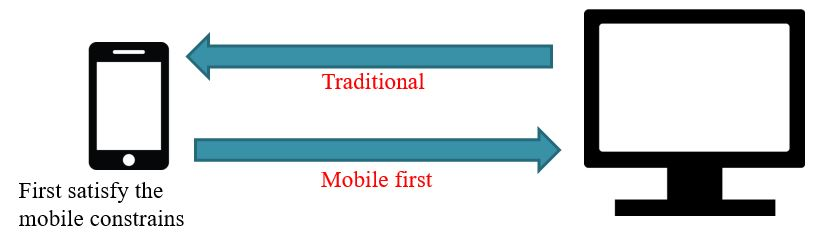

  * **Responsive web design**

    is a way of designing websites for Smaller Screens, and then progressively adjusts your design for devices with larger screens using **CSS Media Queries**

   * **CSS Media Queries**

       CSS technology to apply some styles based on the size of the viewport.

       Example:

       ```CSS
       @media screen and (max-width: 768px) {

           /* Some CSS styles customized for Extra small devices (Phones) */

       }
       ```

* **Browser compatibility**

   Bootstrap is compatible with all modern browsers (Chrome, Firefox, Internet Explorer, Safari, and Opera)

* **Increased productivity**

   Easy to get started.  Anybody with just basic knowledge of HTML and CSS can start using Bootstrap.

* **Community support:**

   Resources and web page templates, workarounds

* **Provides a solution for building an interface for developers**

* **It contains functional built-in components which are easy to customize**

* **Web-based customization**

* **Open source**


## Getting Bootstrap

1. Download compiled (and minified) files from http://getbootstrap.com

   ```
   bootstrap/
   |—— css/
   | |—— bootstrap.css
   | |—— bootstrap.min.css
   | |—— bootstrap-theme.css
   | |—— bootstrap-theme.min.css
   |—— js/
   | |—— bootstrap.js
   | |—— bootstrap.min.js
   |—— fonts/
   | |—— glyphicons-halflings-regular.eot
   | |—— glyphicons-halflings-regular.svg
   | |—— glyphicons-halflings-regular.O
   | |—— glyphicons-halflings-regular.woff
   ```

2. Include Bootstrap from a CDN

   ```html
   <!-- Latest compiled and minified CSS -->
   <link rel="stylesheet" href="https://maxcdn.bootstrapcdn.com/bootstrap/3.3.7/css/bootstrap.min.css">

   <!-- jQuery (necessary for Bootstraps javaScript plugins) -->
   <script src="https://ajax.googleapis.com/ajax/libs/jquery/1.12.4/jquery.min.js"></script>

   <!-- Latest compiled javaScript -->
   <script src="https://maxcdn.bootstrapcdn.com/bootstrap/3.3.7/js/bootstrap.min.js"></script>
   ```


## Using Bootstrap

* Include these lines in the **\<head>** of your html code

  ```html
  <meta charset="utf-8">
  <meta http-equiv="X-UA-Compatible" content="IE=edge">
  <meta name="viewport" content="width=device-width, initial-scale=1">
  ```
  The above 3 meta tags *must* come first in the head; any other head content must come *after* these tags

* Include the **CSS** files in the **\<head>**


  ```html
  <!-- Bootstrap core CSS -->
  <link href="css/bootstrap.min.css" rel="stylesheet">

  <!-- This CSS file (bootstrap-theme.min.css) is optional -->
  <link href="css/bootstrap-theme.min.css" rel="stylesheet">
  ```

* Include the JavaScript files at the bottom of the **\<body>** (**why?**)

  ```
  <!–- jQuery library (necessary for Bootstrap JavaScript plugins) -->
  <script src="https://ajax.googleapis.com/ajax/libs/jquery/1.12.4/jquery.min.js"></script>

  <!–- Bootstrap core JavaScript -->
  <script src="js/bootstrap.min.js"></script>
  ```


## Viewport

```html
<meta name="viewport" content="width=device-width, initial-scale=1">
```

The viewport meta tag:

* Ensures that the screen width is set to the device width and the content is rendered with this width in mind
* Designing the websites to be responsive to the size of the viewport


## Bootstrap's Grid System

* Bootstrap includes a responsive, mobile first fluid grid system that appropriately scales up to 12 columns as the device or viewport size increases.
* It includes predefined classes for easy layout options, as well as powerful mixins for generating more semantic layouts.

### Container Class

Bootstrap requires a containing element to wrap site contents (in the **\<body>** section of the page).

There are two container classes to choose from:

* The **.container** class:

  ```html
  <div class="container">
    ...
  </div>
  ```
  * container for all the content of the site
  * provides a responsive fixed width container (width depends on screen size)
  * use as the outermost div to wrap all the site content for the grid to work correctly

* The **.container-fluid** class:

    ```html
     <div class="container-fluid">
        ...
     </div>
     ```
  * container for all the content of the site
  * provides a full width container, spanning the entire width of the viewport
  * use as the outermost div to wrap all the site content for the grid to work correctly

**Note:** Containers are not nestable (you cannot put a container inside another container).

Example code:

```html
<!DOCTYPE html>
<html>
    <head>
        <meta charset="utf-8">
        <meta http-equiv="X-UA-Compatible" content="IE=edge">
        <meta name="viewport" content="width=device-width, initial-scale=1">
        <!-- The above 3 meta tags *must* come first in the head; any other head content must come *after* these tags -->

        <title>Sample Template for Bootstrap</title>

        <!-- Bootstrap core CSS -->
        <link rel="stylesheet" href="https://maxcdn.bootstrapcdn.com/bootstrap/3.3.7/css/bootstrap.min.css">

        <!-- HTML5 shim and Respond.js for IE8 support of HTML5 elements and media queries -->
        <!-- WARNING: Respond.js doesn't work if you view the page via file:// -->
        <!--[if lt IE 9]>
          <script src="https://oss.maxcdn.com/html5shiv/3.7.3/html5shiv.min.js"></script>
          <script src="https://oss.maxcdn.com/respond/1.4.2/respond.min.js"></script>
        <![endif]-->
    </head>
    <body>
        <div class="container">
            <h1>Bootstrap sample template</h1>
        </div><!-- /.container -->

        <!-- JavaScript files before the closing body tag -->
        <script src="https://ajax.googleapis.com/ajax/libs/jquery/1.12.4/jquery.min.js"></script>
        <script src="https://maxcdn.bootstrapcdn.com/bootstrap/3.3.7/js/bootstrap.min.js"></script>
    </body>
</html>
```

### Bootstrap Rows

```html
<div class="row">
    ...
</div>
```

* Divide the page (width) into a row
* Rows act as horizontal grouping for columns
* Rows must be inside containers (`.container` or `.container-fluid`)

### <a name="gridclasses"></a>Bootstrap Collumns - Grid Classes

Bootstrap 3 includes predefined grid classes for quickly making grid layouts for different types of devices like cell phones, tablets, laptops and desktops, etc.
For example, you can use the `.col-xs-*` class to create grid columns for extra small devices like cell phones,
 similarly the `.col-sm-*` class for small screen devices like tablets, the `.col-md-*` class for medium size devices like desktops
  and the `.col-lg-*` for large desktop screens.

* `col-xs-*` - defines 1-12 columns in an extra small device (phone)
* `col-sm-*` - defines 1-12 columns in an small device (tablets)
* `col-md-*` - defines 1-12 columns in a medium device (desktop)
* `col-lg-*` - defines 1-12 columns in a large desktop screens

First; create a row (`<div class="row">`). Then, add the desired number of columns (tags with appropriate `.col-*-*` classes).

**Note:** that numbers in `.col-*-*` should always add up to 12 for each row.

#### Offsetting columns

Move columns to the right using `.col-md-offset-*` classes. These classes increase the left margin of a column by `*` columns.

For example, `.col-md-offset-4` moves `.col-md-4` over four columns.

```html
<div class="row">
    <div class="col-md-4">.col-md-4</div>
    <div class="col-md-4 col-md-offset-4">.col-md-4 .col-md-offset-4</div>
</div>
<div class="row">
    <div class="col-md-3 col-md-offset-3">.col-md-3 .col-md-offset-3</div>
    <div class="col-md-3 col-md-offset-3">.col-md-3 .col-md-offset-3</div>
</div>
<div class="row">
    <div class="col-md-6 col-md-offset-3">.col-md-6 .col-md-offset-3</div>
</div>
```


#### Column ordering

Easily change the order of our built-in grid columns with `.col-md-push-*` and `.col-md-pull-*` modifier classes.

```html
<div class="row">
    <div class="col-md-9 col-md-push-3">.col-md-9 .col-md-push-3</div>
    <div class="col-md-3 col-md-pull-9">.col-md-3 .col-md-pull-9</div>
</div>
```

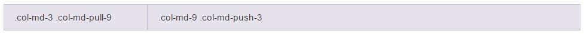

### How Bootstrap Grid System works?

Grid systems are used for creating page layouts through a series of rows and columns that house your content. Here's how the Bootstrap grid system works:

* Rows must be placed within a `.container` (or `.container-fluid`)  class for proper alignment and padding
* Use rows to create horizontal groups of columns
* Content should be placed within the columns, and only columns may be the immediate children of rows
* Columns create gutters (gaps between column content) via `padding`
* Grid columns are created by specifying the number of twelve available columns you wish to span. For example, three equal columns would use three `.col-xs-4`
* If more than 12 columns are placed within a single row, each group of extra columns will, as one unit, wrap onto a new line
* Grid classes apply to devices with screen widths greater than or equal to the breakpoint sizes, and override grid classes targeted at smaller devices.
 Therefore, e.g. applying any `.col-md-*` class to an element will not only affect its styling on medium devices but also on large devices if a `.col-lg-*` class is not present

### Grid options

See how aspects of the Bootstrap grid system work across multiple devices with a handy table:

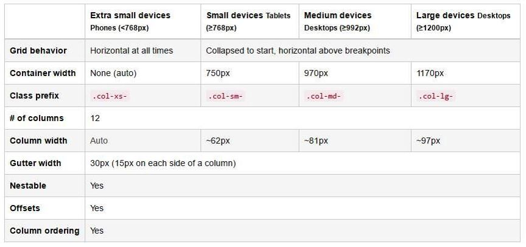

### Example

```html
<!DOCTYPE html>
<html>
    <head>
        <meta charset="utf-8">
        <meta http-equiv="X-UA-Compatible" content="IE=edge">
        <meta name="viewport" content="width=device-width, initial-scale=1">
        <!-- The above 3 meta tags *must* come first in the head; any other head content must come *after* these tags -->

        <title>Sample Template for Bootstrap</title>
        <!-- Bootstrap core CSS -->
        <link rel="stylesheet" href="https://maxcdn.bootstrapcdn.com/bootstrap/3.3.7/css/bootstrap.min.css">

        <!-- Adding some custom style to page -->
        <style type="text/css">
            p {
                background-color: orange;
                text-align: center;
                padding: 10px 0;
            }
        </style>

        <!-- HTML5 shim and Respond.js for IE8 support of HTML5 elements and media queries -->
        <!-- WARNING: Respond.js doesn't work if you view the page via file:// -->
        <!--[if lt IE 9]>
          <script src="https://oss.maxcdn.com/html5shiv/3.7.3/html5shiv.min.js"></script>
          <script src="https://oss.maxcdn.com/respond/1.4.2/respond.min.js"></script>
        <![endif]-->
    </head>
    <body>
        <div class="container">

            <h1>Example using Bootstrap grid</h1>

            <div class="row">
              <div class="col-md-1"><p>.col-md-1</p></div>
              <div class="col-md-1"><p>.col-md-1</p></div>
              <div class="col-md-1"><p>.col-md-1</p></div>
              <div class="col-md-1"><p>.col-md-1</p></div>
              <div class="col-md-1"><p>.col-md-1</p></div>
              <div class="col-md-1"><p>.col-md-1</p></div>
              <div class="col-md-1"><p>.col-md-1</p></div>
              <div class="col-md-1"><p>.col-md-1</p></div>
              <div class="col-md-1"><p>.col-md-1</p></div>
              <div class="col-md-1"><p>.col-md-1</p></div>
              <div class="col-md-1"><p>.col-md-1</p></div>
              <div class="col-md-1"><p>.col-md-1</p></div>
            </div>
            <div class="row">
              <div class="col-md-8"><p>.col-md-8</p></div>
              <div class="col-md-4"><p>.col-md-4</p></div>
            </div>
            <div class="row">
              <div class="col-md-4"><p>.col-md-4</p></div>
              <div class="col-md-4"><p>.col-md-4</p></div>
              <div class="col-md-4"><p>.col-md-4</p></div>
            </div>
            <div class="row">
              <div class="col-md-6"><p>.col-md-6</p></div>
              <div class="col-md-6"><p>.col-md-6</p></div>
            </div>

        </div><!-- /.container -->

        <!-- JavaScript files before the closing body tag -->
        <script src="https://ajax.googleapis.com/ajax/libs/jquery/1.12.4/jquery.min.js"></script>
        <script src="https://maxcdn.bootstrapcdn.com/bootstrap/3.3.7/js/bootstrap.min.js"></script>
    </body>
</html>
```

**Display in Browser:**

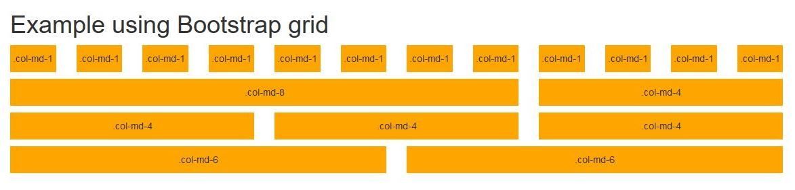
---


## Bootstrap Typography

### Bootstrap's Default Settings

* Bootstrap's global default font-size is 14px, with a line-height of 1.428.
* This is applied to the `<body>` element and all paragraphs (`<p>`).
* In addition, all `<p>` elements have a bottom margin that equals half their computed line-height (10px by default).

### Heading

* All HTML headings, `<h1>` through `<h6>`, are available
* `.h1` through `.h6` classes are also available,
 for when you want to match the font styling of a heading but still want your text to be displayed inline.

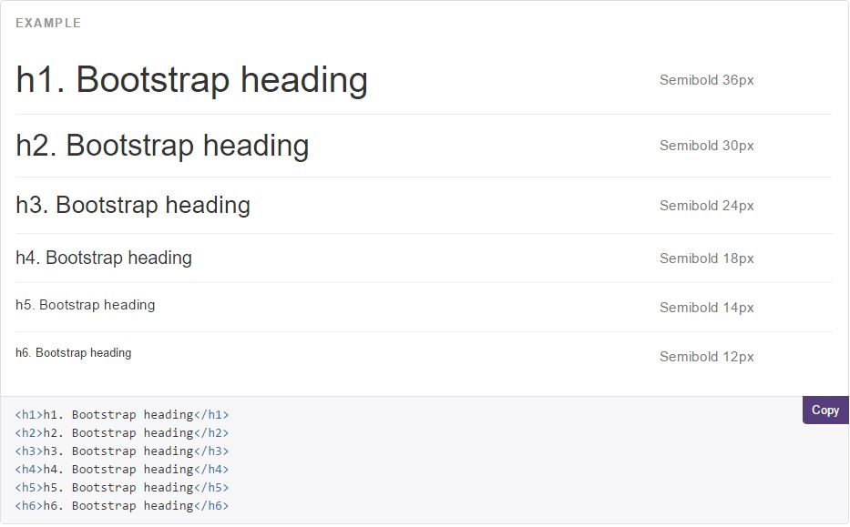

### Alignment classes

Bootstrap also has some alignment classes that can easily realign text to components.

* `.text-left`: Indicates left-aligned text

  ```html
  <p class="text-left">Left aligned text.</p>
  ```

* `.text-center`: Indicates center-aligned text

  ```html
  <p class="text-center">Center aligned text.</p>
  ```

* `.text-right`: Indicates right-aligned text

  ```html
  <p class="text-right">Right aligned text.</p>
  ```

* `.text-justify`: Indicates justified text

  ```html
  <p class="text-justify">Justified text.</p>
  ```

* `.text-nowrap`: Indicates no wrap text

  ```html
  <p class="text-nowrap">No wrap text.</p>
  ```

### Transformation classes

* `.text-lowercase`: Indicates lowercased text

  ```html
  <p class="text-lowercase">Lowercased text.</p>
  ```

* `.text-uppercase`: Indicates uppercased text.

  ```html
   <p class="text-uppercase">Uppercased text.</p>
  ```

* `.text-capitalize`: Indicates capitalized text

  ```html
  <p class="text-capitalize">Capitalized text.</p>
  ```

### Contextual colors

Bootstrap also has some contextual classes (`.text-muted`, `.text-primary`, `.text-success`, `.text-info`, `.text-warning`, `.text-danger`) that can be used to provide "meaning through color". These may also be applied to links and will darken on hover.

**Example:**

```html
<p class="text-muted">Fusce dapibus, tellus ac cursus commodo, tortor mauris nibh.</p>

<p class="text-primary">Nullam id dolor id nibh ultricies vehicula ut id elit.</p>

<p class="text-success">Duis mollis, est non commodo luctus, nisi erat porttitor ligula.</p>

<p class="text-info">Maecenas sed diam eget risus varius blandit sit amet non magna.</p>

<p class="text-warning">Etiam porta sem malesuada magna mollis euismod.</p>

<p class="text-danger">Donec ullamcorper nulla non metus auctor fringilla.</p>
```

**Result in Browser:**

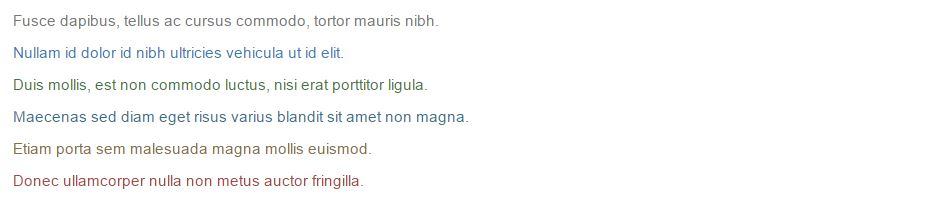

### Contextual backgrounds

Similar to the contextual text color classes, the classes for background colors are: `.bg-primary`, `.bg-success`, `.bg-info`, `.bg-warning` and `.bg-danger`:

**Example:**

```html
<p class="bg-primary">Nullam id dolor id nibh ultricies vehicula ut id elit.</p>

<p class="bg-success">Duis mollis, est non commodo luctus, nisi erat porttitor ligula.</p>

<p class="bg-info">Maecenas sed diam eget risus varius blandit sit amet non magna.</p>

<p class="bg-warning">Etiam porta sem malesuada magna mollis euismod.</p>

<p class="bg-danger">Donec ullamcorper nulla non metus auctor fringilla.</p>
```

**Result in Browser:**

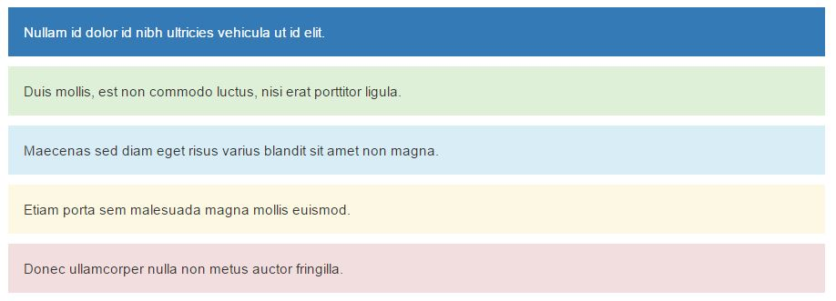

### More Helper Classes

Class | Description
------------ | -------------
`.lead` | Makes a paragraph stand out
`.small` | Indicates smaller text (set to 85% of the size of the parent)
`.list-unstyled` | Removes the default list-style and left margin on list items (works on both `<ul>` and `<ol>`). This class only applies to immediate children list items (to remove the default list-style from any nested lists, apply this class to any nested lists as well)
`.list-inline` | Places all list items on a single line


## Bootstrap Tables


### Basic table

A basic Bootstrap table has a light padding and only horizontal dividers.

The `.table` class adds basic styling to a table.

**Example:**

```html
...
<table class="table">
    <thead>
        <tr>
            <th>Firstname</th>
            <th>Lastname</th>
            <th>Email</th>
        </tr>
    </thead>
    <tbody>
        <tr>
            <td>John</td>
            <td>Doe</td>
            <td>john@example.com</td>
        </tr>
        <tr>
            <td>Mary</td>
            <td>Moe</td>
            <td>mary@example.com</td>
        </tr>
        <tr>
            <td>July</td>
            <td>Dooley</td>
            <td>july@example.com</td>
        </tr>
    </tbody>
 </table>
 ...
```

**Render in Browser:**

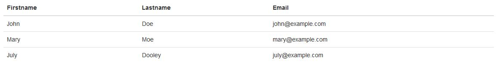

### Striped Rows

The `.table-striped` class adds zebra-stripes to a table.

```html
<table class="table table-striped">
...
</table>
```

**Note:** Striped tables are styled via the `:nth-child` CSS selector, which is not available in Internet Explorer 8.

### Bordered table

Add `.table-bordered` for borders on all sides of the table and cells.

```html
<table class="table table-bordered">
...
</table>
```

### Hover rows

The `.table-hover` class adds a hover effect (grey background color) on table rows.

```html
<table class="table table-hover">
  ...
</table>
```

### Condensed table

The `.table-condensed` class makes a table more compact by cutting cell padding in half.

```html
<table class="table table-condensed">
  ...
</table>
```

### Contextual classes

Use contextual classes to color table rows or individual cells.

Class | Description
------------ | -------------
`.active` | Applies the hover color to a particular row or cell
`.success` | Indicates a successful or positive action
`.info` | Indicates a neutral informative change or action
`.warning` | Indicates a warning that might need attention
`.danger` | Indicates a dangerous or potentially negative action

**Example:**

```html
...
<table class="table table-striped table-bordered table-hover table-condensed">
    <thead>
        <tr>
            <th>Firstname</th>
            <th>Lastname</th>
            <th>Email</th>
        </tr>
    </thead>
    <tbody>
        <tr class="active">
            <td>John</td>
            <td>Doe</td>
            <td>john@example.com</td>
        </tr>
        <tr class="success">
            <td>Mary</td>
            <td>Moe</td>
            <td>mary@example.com</td>
        </tr>
        <tr class="warning">
            <td>July</td>
            <td>Dooley</td>
            <td>july@example.com</td>
        </tr>
        <tr class="danger">
            <td>Mary</td>
            <td>Doe</td>
            <td>mdoe@example.com</td>
        </tr>
        <tr class="info">
            <td>John</td>
            <td>Smith</td>
            <td>jsmith@example.com</td>
        </tr>
    </tbody>
 </table>
 ...
```

**Render in Browser:**

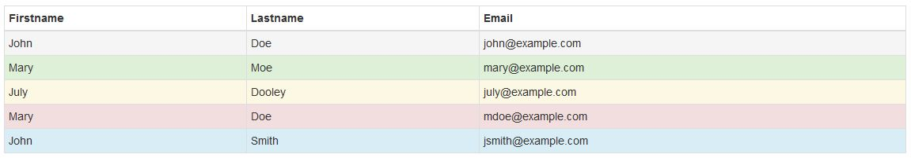

### Responsive tables

Create responsive tables by wrapping any `.table` in `.table-responsive` to make them scroll horizontally on small devices (under 768px).
 When viewing on anything larger than 768px wide, you will not see any difference in these tables.

 ```html
 <div class="table-responsive">
   <table class="table">
     ...
   </table>
 </div>
 ```


## Bootstrap Images

### `` Classes

Class | Description
------------ | -------------
`.img-rounded` | Adds rounded corners to an image (not available in IE8)
`.img-circle` | Shapes the image to a circle (not available in IE8)
`.img-thumbnail` | Shapes the image to a thumbnail
`.img-responsive` | Makes an image responsive (will scale nicely to the parent element)

```html


```

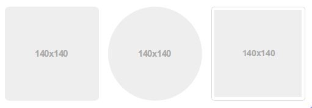


### Responsive Images

Create responsive images by adding an `.img-responsive` class to the `` tag.
 The image will then scale nicely to the parent element.

The `.img-responsive` class applies `max-width: 100%`, `height: auto`, and `display:block` to the image.

```html

```


### Thumbnails

The Bootstrap `thumbnail` component is very useful for creating grids of images or videos, lists of products, portfolios, and much more.


#### Default

Add an `<a>` tag with the class of `.thumbnail` around an image.


```html
<a href="..." class="thumbnail">
    
</a>
```

You can also use Bootstrap's grid system in conjunction with the `.thumbnail` class to create an image gallery.

**Example:**


```html
...
<div class = "row">
    <div class = "col-xs-6 col-md-3">
	    <a href = "..." class = "thumbnail">
		    
		</a>
	</div>
	<div class = "col-xs-6 col-md-3">
	    <a href = "..." class = "thumbnail">
		    
		</a>
	</div>
	<div class = "col-xs-6 col-md-3">
	    <a href = "..." class = "thumbnail">
		    
		</a>
	</div>
	<div class = "col-xs-6 col-md-3">
	    <a href = "..." class = "thumbnail">
		    
		</a>
	</div>
</div>
...
```


**Preview in Browser:**

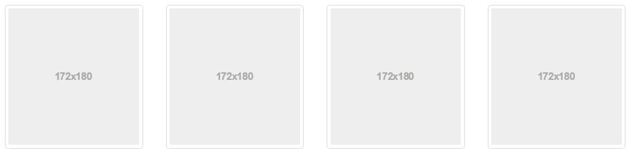


#### Custom content


Add class `.thumbnail` to a `<div>`.

With a bit of extra markup, it's possible to add any kind of HTML content like headings, paragraphs, or buttons into thumbnails:


```html
<div class="thumbnail">
    
    <div class="caption">
        <h3>Thumbnail label</h3>
        <p>...</p>
        <p>
            <a href="#" class="btn btn-primary" role="button">Button</a> <a href="#" class="btn btn-default" role="button">Button</a>
        </p>
    </div>
</div>
```


**Example:**


```html
...
<div class="row">

    <div class="col-sm-3 col-xs-6">
        <div class="thumbnail">
          
          <div class="caption">
            <h3>Dog</h3>
            <p>Lorem ipsum dolor sit amet, consectetuer adipiscing elit, sed diam nonummy nibh euismod tincidunt ut laoreet dolore magna aliquam erat volutpat.</p>
            <p><a href="..." class="btn btn-primary" role="button"><span class="glyphicon glyphicon-link"></span> More</a></p>
          </div>
        </div>
    </div>
    <div class="col-sm-3 col-xs-6">
        <div class="thumbnail">
          
          <div class="caption">
            <h3>Cat</h3>
            <p>Lorem ipsum dolor sit amet, consectetuer adipiscing elit, sed diam nonummy nibh euismod tincidunt ut laoreet dolore magna aliquam erat volutpat.</p>
            <p><a href="..." class="btn btn-primary" role="button"><span class="glyphicon glyphicon-link"></span> More</a></p>
          </div>
        </div>
    </div>
    <div class="col-sm-3 col-xs-6">
        <div class="thumbnail">
          
          <div class="caption">
            <h3>Rabit</h3>
            <p>Lorem ipsum dolor sit amet, consectetuer adipiscing elit, sed diam nonummy nibh euismod tincidunt ut laoreet dolore magna aliquam erat volutpat.</p>
            <p><a href="..." class="btn btn-primary" role="button"><span class="glyphicon glyphicon-link"></span> More</a></p>
          </div>
        </div>
    </div>
    <div class="col-sm-3 col-xs-6">
        <div class="thumbnail">
          
          <div class="caption">
            <h3>Tiger</h3>
            <p>Lorem ipsum dolor sit amet, consectetuer adipiscing elit, sed diam nonummy nibh euismod tincidunt ut laoreet dolore magna aliquam erat volutpat.</p>
            <p><a href="..." class="btn btn-primary" role="button"><span class="glyphicon glyphicon-link"></span> More</a></p>
          </div>
        </div>
    </div>

</div>
...
```


**Preview in Browser:**


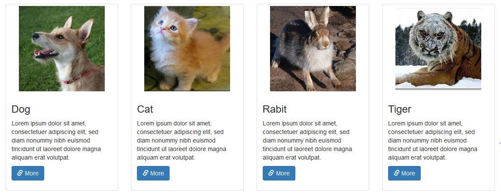


## Bootstrap Media Objects


Bootstrap provides an easy way to align media objects (like images or videos) to the left or to the right of some content.
 This can be used to display blog comments, tweets and so on.

* Use a `<div>` element with the `.media` class to create a container for media objects.
* Use the `.media-left` class to align the media object (image) to the left, or the `.media-right` class to align it to the right.
  * **Note:** `media-right` `div` should be placed after `media-body` `div`
* Text that should appear next to the image, is placed inside a container with `class="media-body"`.
* Use `.media-heading` for headings.

**Example:**

```html
...
<div class="row">
    <div class="col-md-6">

        <!-- Left-aligned media object -->
        <div class="media">
            <div class="media-left">
                
            </div>
            <div class="media-body">
                <h4 class="media-heading">Left-aligned</h4>
                <p>Lorem ipsum dolor sit amet, consectetur adipiscing elit, sed do eiusmod tempor incididunt ut labore et dolore magna aliqua.</p>
            </div>
        </div>

    </div>
    <div class="col-md-6">

        <!-- Right-aligned media object -->
        <div class="media">
            <div class="media-body">
                <h4 class="media-heading">Right-aligned</h4>
                <p>Lorem ipsum dolor sit amet, consectetur adipiscing elit, sed do eiusmod tempor incididunt ut labore et dolore magna aliqua.</p>
            </div>
            <div class="media-right">
                
            </div>
        </div>

    </div>
</div>
...
```


**Preview in Browser:**


### Alignment of Media Objects

The media object can also be top, middle or bottom aligned with the `.media-top` (default), `.media-middle` or `.media-bottom` class

**Example:**

```html
...
<div class="container">
    <div class="media">
        <div class="media-left media-top">
            
        </div>
        <div class="media-body">
            <h4 class="media-heading">Media Top</h4>
            <p>Lorem ipsum dolor sit amet, consectetur adipiscing elit, sed do eiusmod tempor incididunt ut labore et dolore magna aliqua.</p>
            <p>Lorem ipsum dolor sit amet, consectetur adipiscing elit, sed do eiusmod tempor incididunt ut labore et dolore magna aliqua.</p>
            <p>Lorem ipsum dolor sit amet, consectetur adipiscing elit, sed do eiusmod tempor incididunt ut labore et dolore magna aliqua.</p>
        </div>
    </div>

    <div class="media">
        <div class="media-left media-middle">
            
        </div>
        <div class="media-body">
            <h4 class="media-heading">Media Middle</h4>
            <p>Lorem ipsum dolor sit amet, consectetur adipiscing elit, sed do eiusmod tempor incididunt ut labore et dolore magna aliqua.</p>
            <p>Lorem ipsum dolor sit amet, consectetur adipiscing elit, sed do eiusmod tempor incididunt ut labore et dolore magna aliqua.</p>
            <p>Lorem ipsum dolor sit amet, consectetur adipiscing elit, sed do eiusmod tempor incididunt ut labore et dolore magna aliqua.</p>
        </div>
    </div>

    <div class="media">
        <div class="media-left media-bottom">
            
        </div>
        <div class="media-body">
            <h4 class="media-heading">Media Bottom</h4>
            <p>Lorem ipsum dolor sit amet, consectetur adipiscing elit, sed do eiusmod tempor incididunt ut labore et dolore magna aliqua.</p>
            <p>Lorem ipsum dolor sit amet, consectetur adipiscing elit, sed do eiusmod tempor incididunt ut labore et dolore magna aliqua.</p>
            <p>Lorem ipsum dolor sit amet, consectetur adipiscing elit, sed do eiusmod tempor incididunt ut labore et dolore magna aliqua.</p>
        </div>
    </div>
</div>
```

**Preview in Browser:**

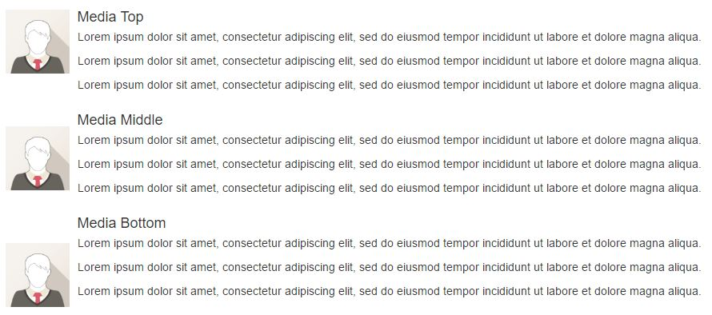


### Responsive Embeds

Allow browsers to determine video or slideshow dimensions based on the width of their containing block by creating an intrinsic ratio that will properly scale on any device.

* Class `.embed-responsive-item` can be applied directly to `<iframe>`, `<embed>`, `<video>`, and `<object>` elements.
* Wrap in a `<div>` with `.embed-responsive` class
  * Add `.embed-responsive-16by9` (16:9 aspect ratio) or `.embed-responsive-4by3` (4:3 aspect ratio) class

    ```html
    <!-- 16:9 aspect ratio -->
    <div class="embed-responsive embed-responsive-16by9">
        <iframe class="embed-responsive-item" src="..."></iframe>
    </div>

    <!-- 4:3 aspect ratio -->
    <div class="embed-responsive embed-responsive-4by3">
        <iframe class="embed-responsive-item" src="..."></iframe>
    </div>
    ```


**Example:**


```html
...
<div class="row">

    <div class="col-md-8">

        <div class="embed-responsive embed-responsive-16by9">
            <iframe class="embed-responsive-item" src="https://www.youtube.com/embed/gqOEoUR5RHg"></iframe>
        </div>

    </div>
    <div class="col-md-4">

        <p>Lorem ipsum dolor sit amet, consectetur adipiscing elit, sed do eiusmod tempor incididunt ut labore et dolore magna aliqua.</p>

    </div>

</div>
...
```


**Preview in Browser:**


## Navbar

A navigation bar is a navigation header that is placed at the top of the page.

With Bootstrap, a navigation bar can extend or collapse, depending on the screen size.

* Navbar is designed to provide a navigation header for your website
* Supports responsive behavior
* Begins collapsed (and are toggleable) in mobile views and become horizontal as the available viewport width increases
* Include a toggle button to show/collapse items
* The navbar collapses into its vertical mobile view when the viewport is narrower than `768px` (the smallest "small" or "tablet" screen)
* Change the point at which your navbar switches between collapsed and horizontal mode. Customize the `@grid-float-breakpoint` (LESS) variable or add your own media query


A standard navigation bar is created with `<nav class="navbar navbar-default">`.

**Example:**

```html
...
<nav class="navbar navbar-default">
    <div class="container">
        <div class="navbar-header">
            <button type="button" class="navbar-toggle collapsed" data-toggle="collapse" data-target="#navbar" aria-expanded="false" aria-controls="navbar">
                <span class="sr-only">Toggle navigation</span>
                <span class="icon-bar"></span>
                <span class="icon-bar"></span>
                <span class="icon-bar"></span>
            </button>
            <a class="navbar-brand" href="#">Bootstrap theme</a>
        </div>
        <div id="navbar" class="navbar-collapse collapse">
            <ul class="nav navbar-nav">
                <li class="active"><a href="#">Home</a></li>
                <li><a href="#about">About</a></li>
                <li><a href="#contact">Contact</a></li>
                <li class="dropdown">
                    <a href="#" class="dropdown-toggle" data-toggle="dropdown" role="button" aria-haspopup="true" aria-expanded="false">Dropdown <span class="caret"></span></a>
                    <ul class="dropdown-menu">
                        <li><a href="#">Action</a></li>
                        <li><a href="#">Another action</a></li>
                        <li><a href="#">Something else here</a></li>
                        <li role="separator" class="divider"></li>
                        <li class="dropdown-header">Nav header</li>
                        <li><a href="#">Separated link</a></li>
                        <li><a href="#">One more separated link</a></li>
                    </ul>
                </li>
            </ul>
        </div><!--/.nav-collapse -->
    </div>
</nav>

<div class="container">
    <h1>Basic Navbar Example</h1>
    <p>A navigation bar is a navigation header that is placed at the top of the page.</p>
</div>
 ...
```

**Preview in Browser (Screen width >= 768px):**

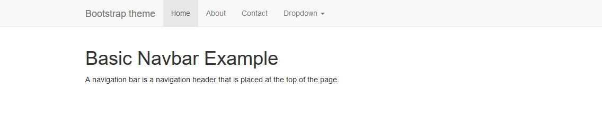

**Preview in Browser (Screen width < 768px):**

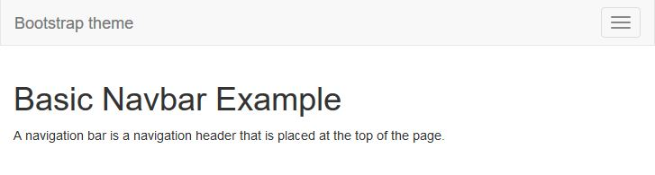


## Jumbotron

* A lightweight, flexible component that can optionally extend the entire viewport to showcase key content on your site (company name, logo etc).
* A jumbotron is displayed as a grey box with rounded corners. It also enlarges the font sizes of the text inside it.
* Can be used outside a container to span the entire screen width
* Use a `<div>` element with class `.jumbotron` to create a jumbotron

**Example (inside a container):**

```html
<div class="container">

    <div class="jumbotron">
        <h1>Company name</h1>
        <p>A slogan</p>
        <p><a class="btn btn-primary btn-lg" href="#" role="button">Learn more</a></p>
    </div>

</div>
```

**Example (outside a container):**

```html
<div class="jumbotron">
     <div class="container">
        <h1>Company name</h1>
        <p>A slogan</p>
        <p><a class="btn btn-primary btn-lg" href="#" role="button">Learn more</a></p>
     </div>
</div>
```


## Bootstrap Buttons

* Button classes can be applied to three elements: `<a>`, `<button>`, `<input>`
* All these will get the button appearance
* Only `<button>` can be used in nav and navbar
* To achieve button styles, Bootstrap has the following classes:
 * `.btn`
 * `.btn-default`
 * `.btn-primary`
 * `.btn-success`
 * `.btn-info`
 * `.btn-warning`
 * `.btn-danger`
 * `.btn-link`

**Example:**

```html
<button type="button" class="btn">Basic</button>

<button type="button" class="btn btn-default">Default</button>

<button type="button" class="btn btn-primary">Primary</button>

<button type="button" class="btn btn-success">Success</button>

<button type="button" class="btn btn-info">Info</button>

<button type="button" class="btn btn-warning">Warning</button>

<button type="button" class="btn btn-danger">Danger</button>

<button type="button" class="btn btn-link">Link</button>
```

**Preview in Browser:**

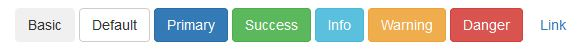


### Button Sizes

Bootstrap provides four button sizes. The classes that define the different sizes are:

* `.btn-lg`
* `.btn-md`
* `.btn-sm`
* `.btn-xs`

**Example:**

```html
<button type="button" class="btn btn-primary btn-lg">Large</button>
<button type="button" class="btn btn-primary btn-md">Medium</button>
<button type="button" class="btn btn-primary btn-sm">Small</button>
<button type="button" class="btn btn-primary btn-xs">XSmall</button>
```

**Preview in Browser:**

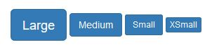

### Block Level Buttons

* A block level button spans the entire width of the parent element.
* Add class `.btn-block` to create a block level button

```html
<button type="button" class="btn btn-primary btn-block">Button 1</button>
```

### Active/Disabled Buttons

* A button can be set to an active (appear pressed) or a disabled (unclickable) state
* The class `.active` makes a button appear pressed, and the class `.disabled` makes a button unclickable

```html
<button type="button" class="btn btn-primary active">Active Primary</button>
<button type="button" class="btn btn-primary disabled">Disabled Primary</button>
```

### Bootstrap Button Classes

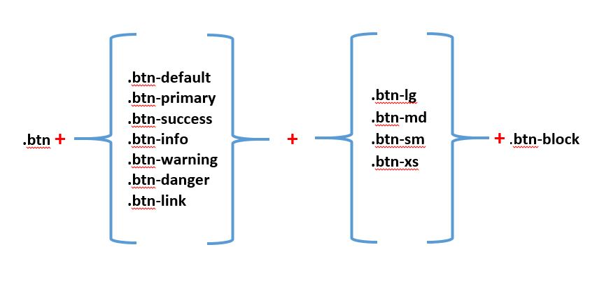


## Glyphicons

* Includes over 250 glyphs in font format from the `Glyphicon Halflings` set.
* Glyphicons can be used in text, buttons, toolbars, navigation, forms, etc.
* To use the Bootstrap icons you will require an `<span>` tag along with a base class `glyphicon` and an individual icon class `glyphicon-*`.

  ```html
  <!-- general syntax -->
  <span class="glyphicon glyphicon-name"></span>
  ```

**Example:**

```html
<!-- icon in button -->
<button type="submit" class="btn btn-success">
    <span class="glyphicon glyphicon-search"></span> Search
</button>
```


**Preview in Browser:**


## Bootstrap Panels and Wells

* Sometimes you may wish to highlight some content on your website
* Panels and wells help


### Panels

* Sometimes you might require to place your content in box for better presentation. In such situation the Bootstrap panel component can be very useful.
* A panel in bootstrap is a bordered box with some padding around its content.
* Panels are created with the `.panel` class, and content inside the panel has a `.panel-body` class.
* You can add a heading to your panel with `.panel-heading` class
* You can also add footer section to your panels using the `.panel-footer` class. The panel's footer can be used to wrap buttons or secondary text.

**Example:**

```html
<div class="panel panel-default">
    <div class="panel-heading">
        <h3 class="panel-title">Panel title</h3>
    </div>
    <div class="panel-body">
        Panel content
    </div>
    <div class="panel-footer">
        Panel footer
    </div>
</div>
```

**Preview in Browser:**

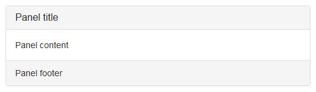

#### Panels with Contextual Classes

Like other components, easily make a panel more meaningful to a particular context by adding any of the contextual state
 classes  (`.panel-default`, `.panel-primary`, `.panel-success`, `.panel-info`, `.panel-warning`, or `.panel-danger`).

```html
<div class="panel panel-primary">...</div>
<div class="panel panel-success">...</div>
<div class="panel panel-info">...</div>
<div class="panel panel-warning">...</div>
<div class="panel panel-danger">...</div>
```

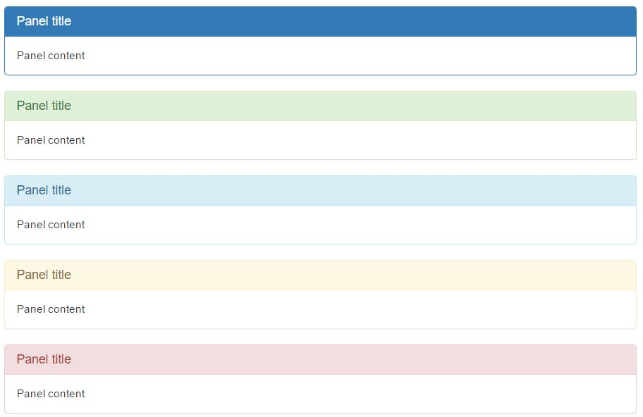

### Wells

* The Bootstrap well component provides a quick way to apply a simple inset effect to an element.
 It will be very helpful if you just want to place some content inside a box to make it look like different from rest of the contents.
  To use this just enclose the contents with a `<div>` element and apply the class `.well` on it.
* The `.well` class adds a rounded border around an element with a gray background color and some padding.

```html
<div class="well">
    Basic Well
</div>
```

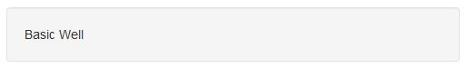

#### Well Sizes

Change the size of the well by adding the `.well-sm` class for small wells or  `.well-lg` class for large wells

```html
<div class="well well-sm">
    Small Well
</div>

<div class="well well-lg">
    Large Well
</div>
```


## Bootstrap Forms


* Form controls automatically receive some global styling with Bootstrap.
* All textual `<input>`, `<textarea>`, and `<select>` elements with `.form-control` are set to `width: 100%;` by default.
* Wrap labels and controls in `.form-group` for optimum spacing.
* Bootstrap provides three different types of form layouts:
  * Vertical Form (default form layout)
  * Horizontal Form
  * Inline Form

### Vertical Form (default)

```html
...
<form action="..." method="...">
    <div class="form-group">
        <label for="exampleInputEmail1">Email address</label>
        <input type="email" class="form-control" id="exampleInputEmail1" placeholder="Email">
    </div>
    <div class="form-group">
        <label for="exampleInputPassword1">Password</label>
        <input type="password" class="form-control" id="exampleInputPassword1" placeholder="Password">
    </div>
    <div class="form-group">
        <label for="exampleInputFile">File input</label>
        <input type="file" id="exampleInputFile">
        <p class="help-block">Example block-level help text here.</p>
    </div>
    <div class="checkbox">
        <label><input type="checkbox"> Check me out</label>
    </div>
    <button type="submit" class="btn btn-default">Submit</button>
</form>
...
```


**Preview in Browser:**


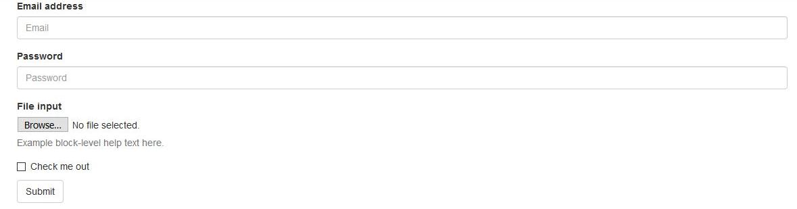


### Inline Form


* Add class `.form-inline` to the `<form>` element
* In an inline form, all of the elements are inline, left-aligned, and the labels are alongside.
  * **Note:** This only applies to forms within viewports that are at least `768px` wide!


```html
...
<form class="form-inline" action="..." method="...">
    <div class="form-group">
        <label for="exampleInputName2">Name</label>
        <input type="text" class="form-control" id="exampleInputName2" placeholder="Jane Doe">
    </div>
    <div class="form-group">
        <label for="exampleInputEmail2">Email</label>
        <input type="email" class="form-control" id="exampleInputEmail2" placeholder="jane.doe@example.com">
    </div>
    <button type="submit" class="btn btn-primary">Send invitation</button>
</form>
...
```


**Preview in Browser:**


### Horizontal Form


* In horizontal form layout labels are right aligned and floated to left to make them appear on the same line as form controls.
* Add the class `.form-horizontal` to the `<form>` element.
* Wrap labels and form controls in a `<div>` element and apply the class `.form-group`.
  * Doing so changes `.form-groups` to behave as grid rows, so no need for `.row`.
* Add the class `.control-label` to the `<label>` element.
* Use Bootstrap's predefined  [grid classes](#gridclasses) to align labels and form controls.


```html
...
<form class="form-horizontal">
    <div class="form-group">
        <label for="inputEmail3" class="col-sm-2 control-label">Email</label>
        <div class="col-sm-10">
            <input type="email" class="form-control" id="inputEmail3" placeholder="Email">
        </div>
    </div>
    <div class="form-group">
        <label for="inputPassword3" class="col-sm-2 control-label">Password</label>
        <div class="col-sm-10">
            <input type="password" class="form-control" id="inputPassword3" placeholder="Password">
        </div>
    </div>
    <div class="form-group">
        <div class="col-sm-offset-2 col-sm-10">
            <div class="checkbox">
                <label><input type="checkbox"> Remember me</label>
            </div>
        </div>
    </div>
    <div class="form-group">
        <div class="col-sm-offset-2 col-sm-10">
            <button type="submit" class="btn btn-default">Sign in</button>
        </div>
    </div>
</form>
...
```


**Preview in Browser:**

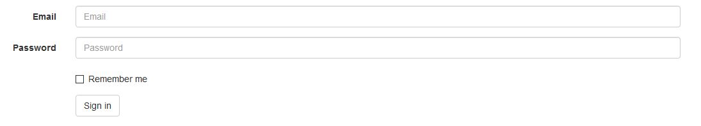


## Project for Practise


### Setting up your Development Environment


#### Software Requirements

* **Text editor**:

  Any text editor that you are already familiar with can be used for editing the project files. In the Course I will use [ATOM](https://atom.io/) with `atom-bootstrap3` package installed.

* **Browser**:

  You may use your preferred browser. In the Course I will use [Firefox Developer Edition](https://www.mozilla.org/en-US/firefox/developer/all/).


#### Project files

* Download the [Project Files](exercise/bootstrap-exercise.zip) and unzip it to a location in your computer, It will create a folder name: `bootstrap-exercise`.
* Open the project folder `bootstrap-exercise` in ATOM


#### Assignment

During this assignment you will should use the page `template.html` as a base `template` in order to create all other pages (`index.html` and `laptop1.html`).

All content text that you will need in the assignment is in the folder `page_text` (`home_text.txt` and `laptop1_text.txt`).

* **Task 1:** Create Home page (`index.html`) and `Navigation Menu`

  * Use `template.html` to create an html page with name: `index.html`
  * Add menu items: `Products`, `About`, `Contact` and `Login` ([See Figure 1 bellow](#figure1))
  * In `Products` Add submenu items: `Laptop`, `Mobile Phone`, `TV` and `Stereo` ([See Figure 2 bellow](#figure2))

* **Task 2:** Add a `Jumbotron`

  * Create a [Bootstrap Jumbotron](https://getbootstrap.com/docs/3.3/components/#jumbotron) ([See Figure 1 bellow](#figure1))
    * create a grid inside Jumbotron (1 row, 2 columns).
      * In the left collumn `<div>` add `col-xs-12`, `col-sm-8` and `col-md-9` classes. The content text of the left column is in the text file `home_text.txt`.
      * In the right collumn `<div>` add `col-xs-12`, `col-sm-4` and `col-md-3` classes. The image logo is `my_estore_logo.png`.


* **Task 3:** Create product grid
  * Use [Bootstap Thumbnail](https://getbootstrap.com/docs/3.3/components/#thumbnails) component in order to present the Products ([See Figure 1 bellow](#figure1)).
    * All the necessary images are in the folder `images`
    * Text is in file `home_text.txt`


* **Task 4:** Add Pagination
  * Use [Bootstrap Pagination](https://getbootstrap.com/docs/3.3/components/#pagination) component in order to add pagination to the page ([See Figure 1 bellow](#figure1))


* **Task 5:** Create a Login Form
  * Use [Bootstrap Forms](https://getbootstrap.com/docs/3.3/css/#forms) to create the `login form`.
  * When `Login` menu item is clicked the login form will appear inside a [Bootstrap Modal](https://getbootstrap.com/docs/3.3/javascript/#modals) ([See Figure 3 bellow](#figure3))


* **Task 6:** Create Product page `laptop1.html` and:
  * Use `template.html` to create an html page with name: `laptop1.html` ([See Figure 4](#figure4) and [See Figure 5](#figure5) bellow).
  * Use [Bootstrap Page header](https://getbootstrap.com/docs/3.3/components/#page-header) component to add page title.
  * Use [Bootstrap Media Object](https://getbootstrap.com/docs/3.3/components/#media) component to present product.
  * Use [Bootstrap Tables](https://getbootstrap.com/docs/3.3/css/#tables) to present product details.
  * Use image `laptop.png` and `laptop1_text.txt` for the content text.

<a name="screenshots"></a>
##### Screenshots


<a name="figure1"></a>
* **`Figure 1`**

  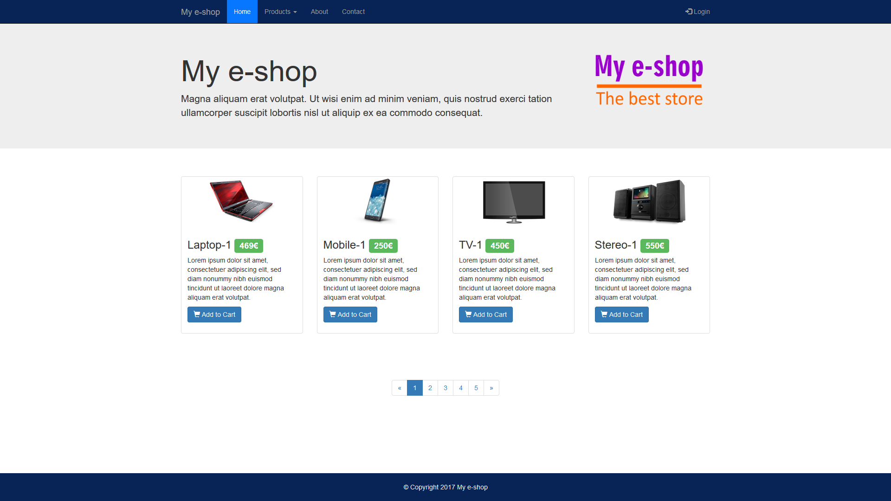

<a name="figure2"></a>
* **`Figure 2`**

  


<a name="figure3"></a>
* **`Figure 3`**

  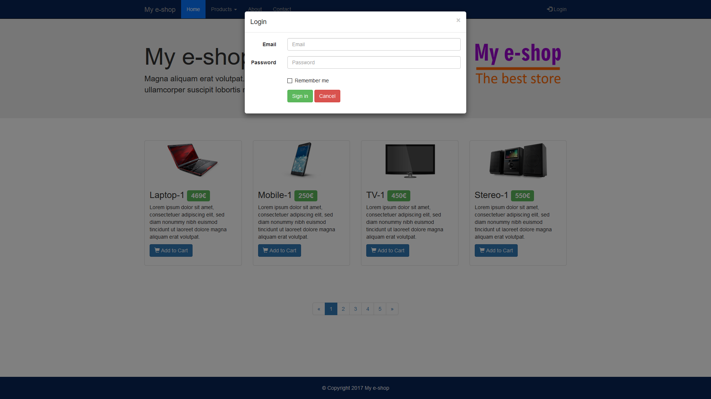


<a name="figure4"></a>
* **`Figure 4`**

  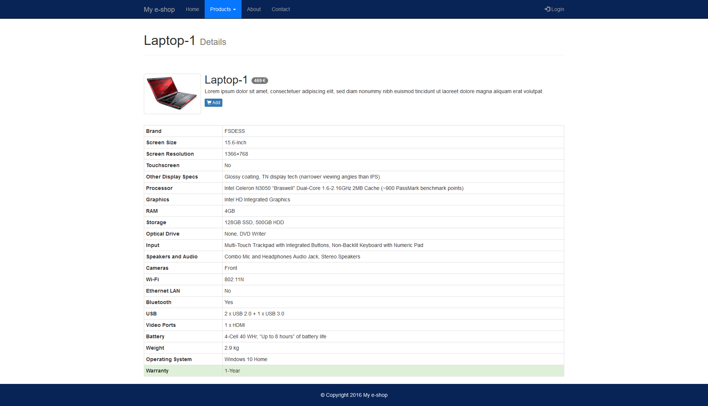


<a name="figure5"></a>
* **`Figure 5`**

  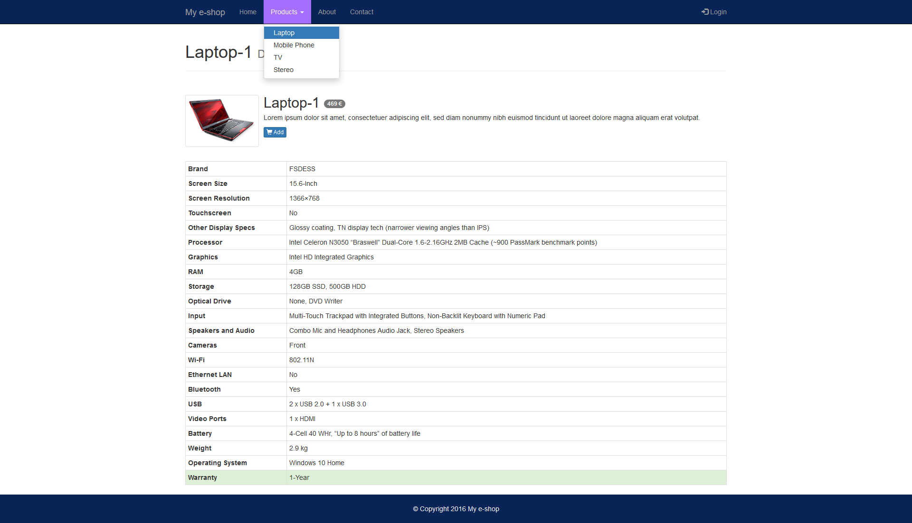


## References

* [https://getbootstrap.com/docs/3.3/](https://getbootstrap.com/docs/3.3/)
* [https://www.w3schools.com/bootstrap/default.asp](https://www.w3schools.com/bootstrap/default.asp)
* [http://www.tutorialrepublic.com/twitter-bootstrap-tutorial/index.php](http://www.tutorialrepublic.com/twitter-bootstrap-tutorial/index.php)
