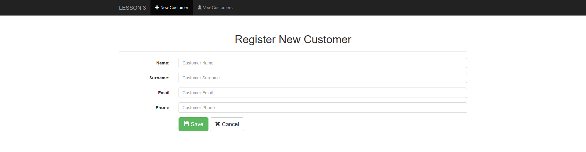
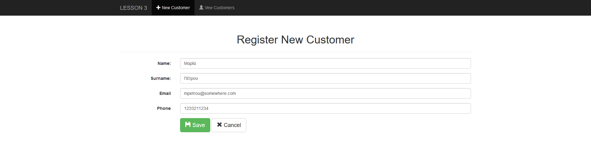
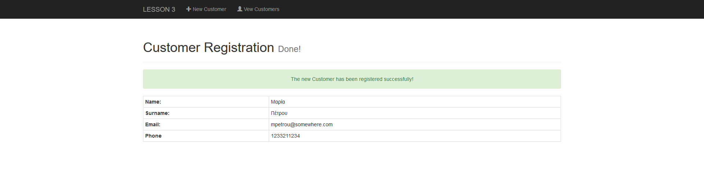
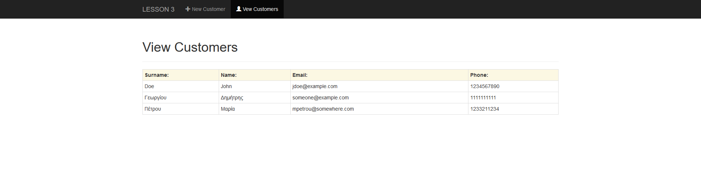

# Java Servlets & JDBC

Author: [Sofoklis Stouraitis](mailto:sofos@aueb.gr)


## Course Software

* [MySQL Community Edition](https://dev.mysql.com/downloads/installer/) (installer includes [MySQL Workbench](https://dev.mysql.com/downloads/workbench/))
* [MySQL Workbench](https://dev.mysql.com/downloads/workbench/)
* [JDBC driver for MySQL](https://dev.mysql.com/downloads/connector/j/)


## Examples

### Example 1

* **Example Project 2**
  * [Download Eclipse Project](examples/exampleproject2.zip)

    **Import Project into Eclipse IDE**
    ```
    Step 1: Download it and unzip it to your computer . Then Copy the project's root folder (exampleproject2) into your Eclipse Workspace.
    Step 2: Open Eclpise, File -> import, type project in the search bar and choose Existing Projects into Workspace and press next
    Step 3: In field select root directory press Browse and select exampleproject2.
    Step 4: Fix 'Java Build Path' according to your system settings: Right click to the project (exampleproject2) and select 'Properties', from the left choose `Java Build Path` and click Tab 'Libraries' and ensure that 'Apache Tomcat' and 'JRE System Library' are according to your system settings.
    ```

  * Connect to your MySQL Server and to do the following:
    * Create a `database` and a `user` with full privileges for only this database
    * Create table `employee` and insert records ([employee.sql](examples/employee.sql))
  * [View this Example Running online (Tomcat)](http://orfeas.dmst.aueb.gr/exampleproject2/search)

### Online Examples

* [http://ism.dmst.aueb.gr/labExercises/](http://ism.dmst.aueb.gr/labExercises/)


## Practise

### Exercise 1

#### Task 1

[Download Eclipse Project](exercises/servlet-jdbc-project-3.zip)


 **Import Project into your Eclipse IDE**

    ```
    Step 1: Download it and unzip it to your computer . Then Copy the project's root folder (servlet-jdbc-project-3) into your Eclipse Workspace.
    Step 2: Open Eclpise, File -> import, type project in the search bar and choose Existing Projects into Workspace and press next
    Step 3: In field select root directory press Browse and select exampleproject2.
    Step 4: Fix 'Java Build Path' according to your system settings: Right click to the project (servlet-jdbc-project-3) and select 'Properties', from the left choose `Java Build Path` and click Tab 'Libraries' and ensure that 'Apache Tomcat' and 'JRE System Library' are according to your system settings.
    ```


#### Task 2

* Connect to your MySQL Server and to do the following:
    * Create a `database` and a `user` with full privileges for only this database
    * Create table `customer` ([customer.sql](exercises/customer.sql))


#### Task 3

Modify the class `CustomerDAO` and finish the methods `getCustomers` and `saveCustomer`:

* `getCustomers` as follow:

  * This method opens connects to the database (via `open` of `DB` class)
  * Selects all customers from `customer` table ordered by surname.
  * For every customer found in the database it creates a `Customer` object and add it to an `ArrayList`
  * closes the connection (via `close` of `DB` class)
  * Finally, `return` an `ArrayList` of `Customer` objects.
  * The method `throws` an `Exception` with the appropriate message if any error occur.

* `saveCustomer` as follow:

  * This method opens connects to the database (via `open` of `DB` class)
  * Takes customer data (`Customer` object) and insert to the `customer` table.
  * Closes the connection (via `close` of `DB` class)
  * The method `throws` an `Exception` with the appropriate message if any error occur.


#### Task 4

Modify the Servlet `ViewCustomers` so as to print in a table (Bootstrap) all Customers the are stored in the table `customer` (see `Figure 4` below)

### Figures

**Figure 1:**




**Figure 2:**




**Figure 3:**




**Figure 4:**




## Useful Links

* [Package java.sql](https://docs.oracle.com/javase/8/docs/api/index.html?java/sql/package-summary.html)
* [https://dev.mysql.com/doc/connector-j/5.1/en/connector-j-examples.html](https://dev.mysql.com/doc/connector-j/5.1/en/connector-j-examples.html)
* [https://www.javatpoint.com/java-jdbc](https://www.javatpoint.com/java-jdbc)
* [https://www.tutorialspoint.com/jdbc/index.htm](https://www.tutorialspoint.com/jdbc/index.htm)
