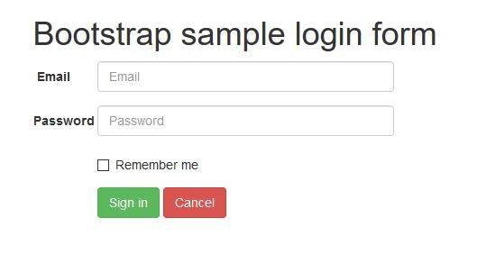
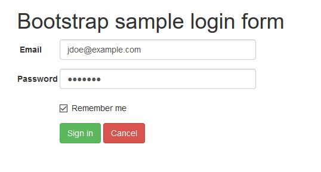
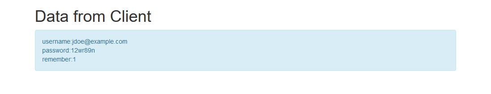
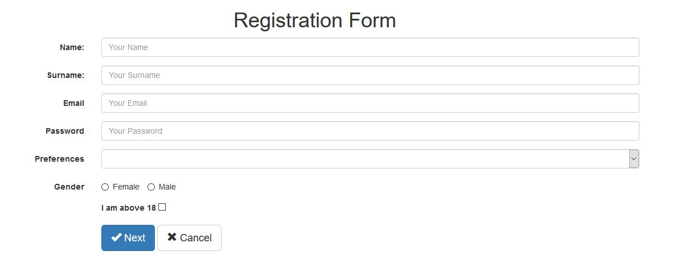
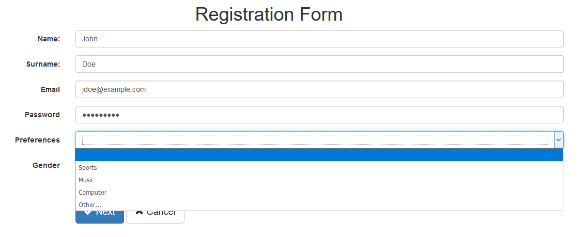
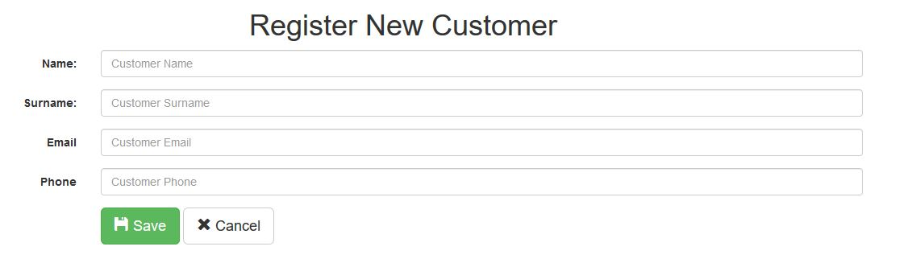
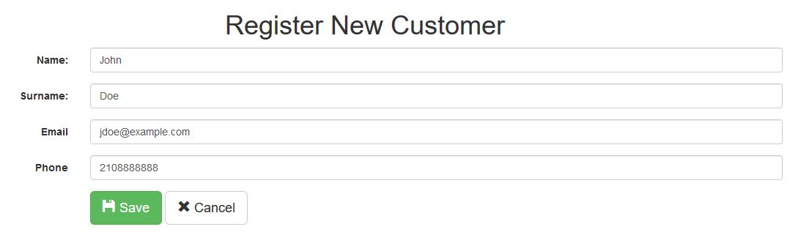
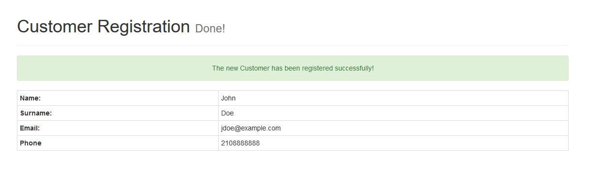

# Intro to Java Servlets

Author: [Sofoklis Stouraitis](mailto:sofos@aueb.gr)


## Course Software

* Download and install latest [Java Development Kit](http://www.oracle.com/technetwork/java/javase/downloads/jdk8-downloads-2133151.html)
* Download and install latest stable release of [Apache Tomcat](http://tomcat.apache.org/) Web Server
* Download and install [Eclipse IDE for Java EE Developers](http://www.eclipse.org/downloads/packages/eclipse-ide-java-ee-developers/neon3)


## What are Servlets?


* A servlet is a Java programming language class used to extend the capabilities of servers that host applications accessed by means of a request-response programming model. Although servlets can respond to any type of request, they are commonly used to extend the applications hosted by web servers. For such applications, Java Servlet technology defines HTTP-specific servlet classes.

    > From the Oracle website

* `Servlets` are `Java classes` that are compiled to byte code that can be loaded dynamically into and run by a Java technology-enabled Web server (supports the Java Servlet specification) or `Servlet container`
* The javax.servlet and `javax.servlet.http` packages provide `interfaces` and `classes` for writing `servlets`.
* `Servlets` have access to the entire family of `Java APIs`, including the `JDBC API` to access databases.
* Using `Servlets`, you can collect input from users through web page forms, present records from a database or another source, and create web pages dynamically.
* Like other Java technology-based components, `servlets` are platform-independent Java classes that are compiled to platform-neutral byte code that can be loaded dynamically into and run by a Java technology-enabled Web server.
* Servlets interact with Web clients via a `request/response` paradigm implemented by the `servlet` container.

**Servlet Containers:** Containers, sometimes called `servlet engines`, are Web server extensions that provide servlet functionality.


## Servlet lifecycle

The lifecycle of a servlet is controlled by the container in which the servlet has been deployed. When a request is mapped to a servlet, the container performs the following steps:

1. If an instance of the servlet does not exist, the web container:
   1. Loads the servlet class
   2. Creates an instance of the servlet class
   3. Initializes the servlet instance by calling the `init` method
2. The container invokes the `service` method, passing `request` and `response` objects in order to handle request from the client. The container calls this method each time when request for the servlet is received.

If it needs to remove the servlet, the container finalizes the servlet by calling the servlet's `destroy` method.

```java
package org.afdemp.bootcamp2.servlets;

import java.io.IOException;
import javax.servlet.ServletException;
import javax.servlet.annotation.WebServlet;
import javax.servlet.http.HttpServlet;
import javax.servlet.http.HttpServletRequest;
import javax.servlet.http.HttpServletResponse;

@WebServlet("/example")
public class ExampleServlet extends HttpServlet {
    private static final long serialVersionUID = 1L;

    protected void doGet(HttpServletRequest request, HttpServletResponse response) throws ServletException, IOException {
        /* code to handle GET requests */
    }

    protected void doPost(HttpServletRequest request, HttpServletResponse response) throws ServletException, IOException {
        /* code to handle POST requests */
    }

}
```


## `@WebServlet`

* Use the `@WebServlet` annotation to define a servlet component in a web application.
* @WebServlet annotation is used to map the servlet with one (or more) URL pattern.
* The annotated `Servlet` must specify at least one URL pattern.
* If the `Servlet` is not annotated a deployment descriptor (`web.xml` file) is required

**Example define a URL Patern**
```java
@WebServlet("/report")
```


**Example define a multiple URL Paterns**
```java
@WebServlet({ "/report", "/viewreport" })
```


## Servlet Methods

### `init()`

The `init` method is designed to be called only once. It is called when the servlet is first created, and not called again for each user request. So, it is used for one-time initializations.

### `service()`

The `service` method is the main method to perform the actual task. The servlet container calls the `service` method to handle requests coming from the client (ex: via a browser).
Each time the server receives a request for a `servlet`, the server spawns a new thread and calls `service`. The `service` method checks the `HTTP request` type (`GET`, `POST`, `PUT`, `DELETE`, etc.) and calls `doGet`, `doPost`, `doPut`, `doDelete`, etc. methods as appropriate.

So you have nothing to do with `service` method but you override either `doGet` or `doPost` etc. depending on what type of request you receive from the client.

### `doGet()`

The `doGet` method handles Http `GET` requests. This method is called everytime the Servlet receives `GET` requests from a client.

A GET request results from:
 * a normal request for a URL
   ```html
   http://www.example.com/example
   ```
 * a request from an HTML form that has no METHOD specified (or GET specified).
   ```html
    <form action="..." method="get">
        ...
    </form>
    ```

### `doPost()`

The `doPost` method handles Http `POST` requests. This method is called everytime the Servlet receives `POST` requests from a client.

A `POST` request results from an HTML form that specifies `POST` as the Method.

```html
<form action="..." method="post">
    ...
</form>
```


## Servlets & Html

```java
// Setting the response content type
response.setContentType("text/html; charset=UTF-8");
```

**Example 1:**

```java
package org.afdemp.bootcamp2.servlets;

import java.io.IOException;
import java.io.PrintWriter;
import javax.servlet.ServletException;
import javax.servlet.annotation.WebServlet;
import javax.servlet.http.HttpServlet;
import javax.servlet.http.HttpServletRequest;
import javax.servlet.http.HttpServletResponse;

/**
 * Servlet implementation class HelloWorldPage
 */
@WebServlet("/hello")
public class HelloWorldPage extends HttpServlet {
	private static final long serialVersionUID = 1L;

	/**
	 * @see HttpServlet#doGet(HttpServletRequest request, HttpServletResponse
	 *      response)
	 */
	protected void doGet(HttpServletRequest request, HttpServletResponse response)
			throws ServletException, IOException {

		// Set response content type
		response.setContentType("text/html; charset=UTF-8");

		PrintWriter out = new PrintWriter(response.getWriter());
		// Print html code
		out.println("<!DOCTYPE html>");
		out.println("<html>");
		out.println("    <head>");
		out.println("        <meta charset='utf-8'>");
		out.println("        <title>Hello World Example</title>");
		out.println("    </head>");
		out.println("    <body>");
		out.println("      <h1>Hello World</h1>");
		out.println("  </body>");
		out.println("</html>");

	}

	/**
	 * @see HttpServlet#doPost(HttpServletRequest request, HttpServletResponse
	 *      response)
	 */
	protected void doPost(HttpServletRequest request, HttpServletResponse response)
			throws ServletException, IOException {
		// TODO Auto-generated method stub
		doGet(request, response);
	}

}


```


**Run in Tomcat:**


## Send Data to Servlet

### Via a URL (Directly)

```html
http://localhost:8080/project-name/servlet-path?parameter1=value1&parameter2=value2&parameter3=value3 etc...
```


### Via an Html form

```html
...
<form action="login" method="post" class="form-horizontal">
    <div class="form-group">
        <label for="email" class="col-sm-2 control-label">Email</label>
        <div class="col-sm-10">
            <input type="email" name="email" class="form-control" placeholder="Email" required>
        </div>
    </div>
    <div class="form-group">
        <label for="password" class="col-sm-2 control-label">Password</label>
        <div class="col-sm-10">
            <input type="password" name="password" class="form-control" placeholder="Password" required>
        </div>
    </div>
    <div class="form-group">
        <div class="col-sm-10 col-sm-offset-2">
            <label class="checkbox-inline"><input type="checkbox" name="rememberme" value="1"> Remember me</label>
        </div>
    </div>
    <div class="form-group">
        <div class="col-sm-10 col-sm-offset-2">
            <button class="btn btn-success" type="submit">Sign in</button>
            <button type="button" class="btn btn-danger" data-dismiss="modal">Cancel</button>
        </div>
    </div>
</form>
...
```

**Display in Browser:**




## Read Data from Servlet

```java
String parameter1 = request.getParameter("form-element1-name");
String parameter2 = request.getParameter("form-element2-name");
...
```


[`request.getParameter(String name)`](https://docs.oracle.com/javaee/7/api/javax/servlet/ServletRequest.html#getParameter-java.lang.String-): Returns the value of a request parameter as a String, or null if the parameter does not exist. Request parameters are extra information sent with the request. For HTTP servlets, parameters are contained in the query string or posted form data.


Read more about the `request`:
* [Interface ServletRequest](https://docs.oracle.com/javaee/7/api/javax/servlet/ServletRequest.html)
* [Interface HttpServletRequest](https://docs.oracle.com/javaee/7/api/javax/servlet/http/HttpServletRequest.html)


**Example:** Reading parameters from http request (login form above) and print them in a html page (Bootstrap):

```java
package org.afdemp.bootcamp2.servlets;

import java.io.IOException;
import java.io.PrintWriter;
import javax.servlet.ServletException;
import javax.servlet.annotation.WebServlet;
import javax.servlet.http.HttpServlet;
import javax.servlet.http.HttpServletRequest;
import javax.servlet.http.HttpServletResponse;

/**
 * Servlet implementation class LoginHandler
 */
@WebServlet("/login")
public class LoginHandler extends HttpServlet {

    private static final long serialVersionUID = 1L;

    /**
     * @see HttpServlet#HttpServlet()
     */
    public LoginHandler() {
        super();
        // TODO Auto-generated constructor stub
    }

    /**
     * @see HttpServlet#doGet(HttpServletRequest request, HttpServletResponse response)
     */
    protected void doGet(HttpServletRequest request, HttpServletResponse response) throws ServletException, IOException {
        doPost(request, response);
    }

    /**
     * @see HttpServlet#doPost(HttpServletRequest request, HttpServletResponse response)
     */
    protected void doPost(HttpServletRequest request, HttpServletResponse response) throws ServletException, IOException {

        /*
         * Gets parameters from request (html form)
         */
        String username = request.getParameter("email");
        String password = request.getParameter("password");
        String remember = request.getParameter("rememberme");

        // Set response content type
        response.setContentType("text/html; charset=UTF-8");

        PrintWriter out = new PrintWriter(response.getWriter());

        // Print html code...
        out.println("<!DOCTYPE html>");
        out.println("<html>");
        out.println("    <head>");
        out.println("        <meta charset='utf-8'>");
        out.println("        <meta http-equiv='X-UA-Compatible' content='IE=edge'>");
        out.println("        <meta name='viewport' content='width=device-width, initial-scale=1'>");
        out.println("        <!-- The above 3 meta tags *must* come first in the head; any other head content must come *after* these tags -->");
        out.println("        <title>Sample Bootstrap form</title>");
        out.println("        <!-- Bootstrap core CSS -->");
        out.println("        <link rel='stylesheet' href='https://maxcdn.bootstrapcdn.com/bootstrap/3.3.7/css/bootstrap.min.css'>");
        out.println("        <!-- HTML5 shim and Respond.js for IE8 support of HTML5 elements and media queries -->");
        out.println("        <!-- WARNING: Respond.js doesn't work if you view the page via file:// -->");
        out.println("        <!--[if lt IE 9]>");
        out.println("          <script src='https://oss.maxcdn.com/html5shiv/3.7.3/html5shiv.min.js'></script>");
        out.println("          <script src='https://oss.maxcdn.com/respond/1.4.2/respond.min.js'></script>");
        out.println("        <![endif]-->");
        out.println("    </head>");
        out.println("    <body>");
        out.println("      <div class='container'>");
        out.println("        <h1>Data from Client</h1>");
        out.println("        <div class='alert alert-info'>");
        out.println("username:" + username + "<br>");
        out.println("password:" + password + "<br>");
        out.println("remember:" + remember);
        out.println("        </div>");
        out.println("      </div><!-- /.container -->");
        out.println("      <!-- JavaScript files before the closing body tag -->");
        out.println("      <script src='https://ajax.googleapis.com/ajax/libs/jquery/1.12.4/jquery.min.js'></script>");
        out.println("      <script src='https://maxcdn.bootstrapcdn.com/bootstrap/3.3.7/js/bootstrap.min.js'></script>");
        out.println("  </body>");
        out.println("</html>");

    } //End of doPost

} //End of class
```


**Run scenario in Tomcat:**




**LoginHandler Response:**




**Add `Html` to `Servlet`**: [Useful Online Tool](http://ism.dmst.aueb.gr/labExercises/htmltoservlet.html)


## Page Redirection

```java
response.sendRedirect("location");
```

* The simplest way of redirecting a request to another page is using method `sendRedirect` of `response` object.
* Sends a temporary redirect response to the client using the specified redirect location `URL` and clears the buffer.
* `sendRedirect` is the method of [HttpServletResponse](https://docs.oracle.com/javaee/7/api/javax/servlet/http/HttpServletResponse.html) interface which is used to redirect `response` to another resource, it may be `servlet`, `jsp` or `html` page.
* If the location is relative without a leading **`/`** the container interprets it as relative to the current request `URI`.
* If the location is relative with a leading **`/`** the container interprets it as relative to the `servlet container root`.

```java
...
protected void doGet(HttpServletRequest request, HttpServletResponse response) throws ServletException, IOException {
    if(request.getParameter("param1") == null) {
        response.sendRedirect("error.jsp");
        return;
    }
    ...
}
...
```

## Dispatch Request - `RequestDispatcher`

* The `RequestDispacher` interface provides the facility to `forward` a request to another resource or `include` the content of another resource.
* The resource can be dynamic (`servlet`, `jsp`) or static (`html`).
* The `pathname` specified may be relative, although it cannot extend outside the current servlet context.
* If the path begins with a **`/`** it is interpreted as relative to the current context root.

`RequestDispacher` object can be get from `request` (`HttpServletRequest` object) via `getRequestDispatcher` Method.

```java
RequestDispatcher dispatcherName = request.getRequestDispatcher("location");
```

There are two methods defined in the [RequestDispatcher](https://docs.oracle.com/javaee/7/api/javax/servlet/RequestDispatcher.html) interface, `forward` and `include`.

### `forward`

* This method forwards a request from a servlet to another resource on the server.
* This method allows one servlet to do preliminary processing of a request and another resource to generate the response.
* `forward` should be called before the `response` has been committed to the client (before response body output has been flushed). If the `response` already has been committed, this method throws an `IllegalStateException`.

**Example:**

```java
...
RequestDispatcher errorDispatcher = request.getRequestDispatcher("/error");

errorDispatcher.forward(request, response);
```


### `include`

* Includes the content of a resource (`servlet`, `JSP` or `HTML` page) in the response. In essence, this method enables programmatic server-side includes.
* response of second resource (`servlet`, `JSP` or `HTML` page)   is included in the response of the `servlet` that is being sent to the client.
* In a `Servlet`, when `forward` to or `include` another resource (`servlet`, `JSP` or `HTML` page), the `request` object (client's request) is available to the resource too and parameters (user's data) can be read with the same way (`request.getParameter("paramater-name")`).

**Example:**

```java
...
RequestDispatcher pageHeader = request.getRequestDispatcher("header.jsp");

pageHeader.include(request, response);
```


### `request`: Storing and Retrieving Attributes

* Before we `forward` to or `include` another resource we can store an `attribute` (or more) in this request object via the `request.setAttribute` method. Then the attribute can be retrieved by the resource calling the `request.getAttribute` method.
* `Attributes` are reset between requests.


```java
void setAttribute(String name, Object o) -> Stores an attribute in this request.
```

```java
Object getAttribute(String name) -> Returns the value of the named attribute as an Object, or null if no attribute of the given name exists.
```


**Example:** Store an attribute with name `message` with value a `String`

```java
...
RequestDispatcher errorDispatcher = request.getRequestDispatcher("/error");

request.setAttribute("message", "You are not authorized to view this page")

errorDispatcher.forward(request, response);
```

**Example:** Store an attribute with name `newcustomer` with value a `Customer` object

```java
...
RequestDispatcher errorDispatcher = request.getRequestDispatcher("/error");

Customer customer = new Customer("John", "Doe");

request.setAttribute("newcustomer", customer)

errorDispatcher.forward(request, response);
```


**Example:** Retrieving the attribute with name `newcustomer` from the other resource (`servlet`, or `jsp`)

```java
...
Customer cust = (Customer) request.getAttribute("newcustomer");
...
```


## Practise

### Exercise 1

#### Task 1

Create a `Dynamic Web Project` in `Eclipse IDE` with name `servletcourseone`.


#### Task 2

Create a `Html` page with name `registrationform.html` and add a Bootstrap form as in the following figure:

**Registration form:**




**Registration form - Preferences:**




#### Task 3

Create a Servlet with name `RegisterCustomer` that listens to the `/register` URL Path.

The Servlet reads data posted by the form (of the page `registrationform.html`) and prints all data in a Bootstrap table as in the following figure:

**RegisterCustomer Servlet Response:**


### Exercise 2


#### Task 1

Create a `Dynamic Web Project` in `Eclipse IDE` with name `servletcoursetwo`.

#### Task 2

Create a `Servlet` with name `CustomerForm` that (response) prints a customer registration form (Bootstrap) as in the figure bellow:



When user submits the form (press `save` button) the data will be `post`ed to the `CustomerController` Servlet (**Task 3**)

#### Task 3

Create a `Servlet` with name `CustomerController`. `CustomerController` responses to the form of `CustomerForm` (**Task 2**) and do the following:
 * Reads parameters (`name`, `surname` etc... fields of the form) from the request
 * Checks data if valid (ex: fields: `name`, `surname` should be at least 2 chars length and `phone` at least 10 chars length)
   * If data is valid:
     * Creates a new `Customer` ([download class Customer](src/Customer.java)) object using user's data (form)
     * Stores an attribute (to request object) with name `newcustomer` and value the new `Customer` object
     * it forwards the request to the `RegisterCustomer` Servlet (**Task 4**)
   * Otherwise, it redirects back to the `CustomerForm` Servlet

#### Task 4

Create a `Servlet` with name `RegisterCustomer`. `RegisterCustomer` does the following:

* Retrieves `Customer` object from `request` object (attribute `newcustomer`)
* Prints Customer's details ( `name`, `surname` etc...) in a bootstrap table

**Preview Scenario**

* `CustomerForm`: User inserts Customer data and press `save`

  

* `RegisterCustomer` Respone

  


## Examples
* **Example Project 1**
  * [Download Eclipse Project](examples/exampleproject1.zip)

    **Import Project into Eclipse IDE**
    ```
    Step 1: Download it and unzip it to your computer . Then Copy the project's root folder (exampleproject1) into your Eclipse Workspace.
    Step 2: Open Eclpise, File -> import, type project in the search bar and choose Existing Projects into Workspace and press next
    Step 3: In field select root directory press Browse and select exampleproject1.
    Step 4: Fix 'Java Build Path' according to your system settings: Right click to the project (exampleproject1) and select 'Properties', from the left choose `Java Build Path` and click Tab 'Libraries' and fix 'Apache Tomcat' and 'JRE System Library' by change to your settings.
    ```

  * [View Example Running online (Tomcat)](http://orfeas.dmst.aueb.gr/exampleproject1/search)
* [http://ism.dmst.aueb.gr/labExercises/](http://ism.dmst.aueb.gr/labExercises/)


## References

* [http://download.oracle.com/otndocs/jcp/servlet-3_1-fr-eval-spec/index.html](http://download.oracle.com/otndocs/jcp/servlet-3_1-fr-eval-spec/index.html)
* [https://docs.oracle.com/javaee/7/tutorial/servlets.htm](https://docs.oracle.com/javaee/7/tutorial/servlets.htm)
* [https://www.tutorialspoint.com/servlets/index.htm](https://www.tutorialspoint.com/servlets/index.htm)
* [http://o7planning.org/en/10169/java-servlet-tutorial](http://o7planning.org/en/10169/java-servlet-tutorial)
* [http://docs.oracle.com/javaee/7/api/index.html](http://docs.oracle.com/javaee/7/api/index.html)
